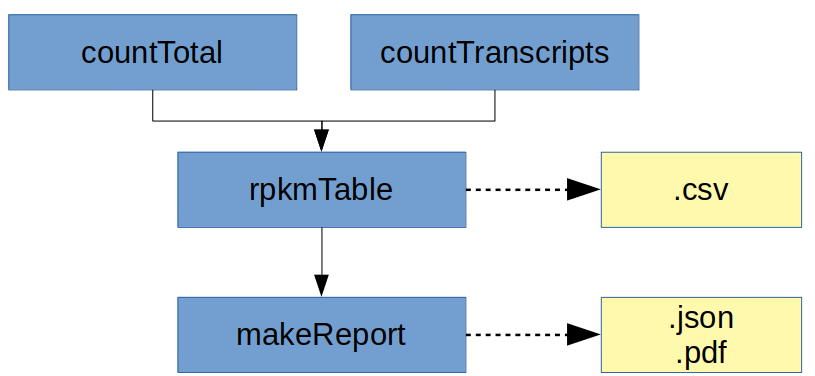

# ercc



## Usage

## Cromwell

``` 
 java -jar cromwell.jar run ercc.wdl --inputs inputs.json 
```

## Running Pipeline

```
 
 task countTotal:   procedure for counting reads in fastq file

 task countTranscripts: procedure for counting ERCC transcripts, counts bwa-aligned reads with chimeric reference

 task rpkmTable: this task produces rpkm counts using outputs from previous tasks

 task makeReport: making report and formatting results in json format

```

The workflow will accept paired or single-end sequencing data in fastq format. Assemblies for hg19 and hg38 are both supported. 

## Optional Assembly-specific Parameters:

hg19-specific data, for other assemblies these should be configured with olive:

Paramter|Value
---|---
ercc.countTranscripts.refGenome | String? (optional, default = "$HG19_ERCC_BWA_INDEX_ROOT/hg19_random_ercc.fa")
ercc.rpkmTable.erccData | String? (optional, default = "$HG19_ERCC_ROOT/ERCC92.gtf")
ercc.makeReport.erccData | String? (optional, default = "$HG19_ERCC_ROOT/ERCC92.gtf")
ercc.makeReport.controlData | String? (optional, default = "$HG19_ERCC_ROOT/ERCC_Controls_Analysis_v2.txt")

## Other Parameters with default values:

Paramter|Value
---|---
ercc.countTranscripts.cnv_file | String (optional, default = "ercc_counts.csv")
ercc.countTranscripts.jobMemory | Int (optional, default = 8 or 10 for computationally-intensive tasks)
ercc.countTranscripts.timeout | Int (optional, default = 20 hours)
ercc.rpkmTable.jobMemory | Int (optional, default = 10)
ercc.makeReport.jobMemory | Int (optional, default = 10)
ercc.countTranscripts.modules | String? (optional, default = "bwa/0.7.17 samtools/0.1.19 hg19-ercc-bwa-index/0.7.17")
ercc.countTranscripts.timeout | Int (optional, default = 20 hours)
ercc.rpkmTable.modules | String? (optional, default = "hg19-ercc/p13")
ercc.rpkmTable.timeout | Int (optional, default = 20 hours)
ercc.makeReport.modules | String? (optional, default = "rstats-cairo/3.6 ercc-scripts/1.1 hg19-ercc/p13")
ercc.countTranscripts.threads | Int (optional, default = 8)
ercc.makeReport.imagingScriptPath | String? (optional, default = "$ERCC_SCRIPTS_ROOT/ercc_plots.R")
ercc.makeReport.Rscript | String? (optional, default = "$RSTATS_CAIRO_ROOT/bin/Rscript")

## Required Inputs:

Paramter|Value
---|---
ercc.outputFileNamePrefix | String? (optional, will be a basename of the first input fastq if not customized)
ercc.mixId | String - need to specify Mix type as in MISO (ERCC Mix 1 or 2)
ercc.fastqR1 | File - first (or the only in case of single-end data) fastq file
ercc.sampleId | String - id of the input sample
ercc.fastqR2 | File? (optional) - second fastq file, optional in case of single-end data

## Outputs

```
  rpkmData  - rpkm numbers for a sample in csv format
  json  - rpkm data in json format
  image - plot in .png format
  pdf   - plot in .pdf format

```

## Niassa + Cromwell

This WDL workflow is wrapped in a Niassa workflow (https://github.com/oicr-gsi/pipedev/tree/master/pipedev-niassa-cromwell-workflow) so that it can used with the Niassa metadata tracking system (https://github.com/oicr-gsi/niassa).

* Building
```
mvn clean install
```

* Testing
```
mvn clean verify \
-Djava_opts="-Xmx1g -XX:+UseG1GC -XX:+UseStringDeduplication" \
-DrunTestThreads=2 \
-DskipITs=false \
-DskipRunITs=false \
-DworkingDirectory=/path/to/tmp/ \
-DschedulingHost=niassa_oozie_host \
-DwebserviceUrl=http://niassa-url:8080 \
-DwebserviceUser=niassa_user \
-DwebservicePassword=niassa_user_password \
-Dcromwell-host=http://cromwell-url:8000
```

## Support

For support, please file an issue on the [Github project](https://github.com/oicr-gsi) or send an email to gsi@oicr.on.ca.
